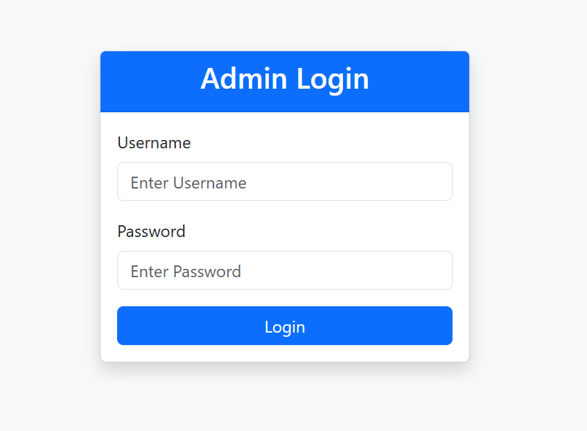
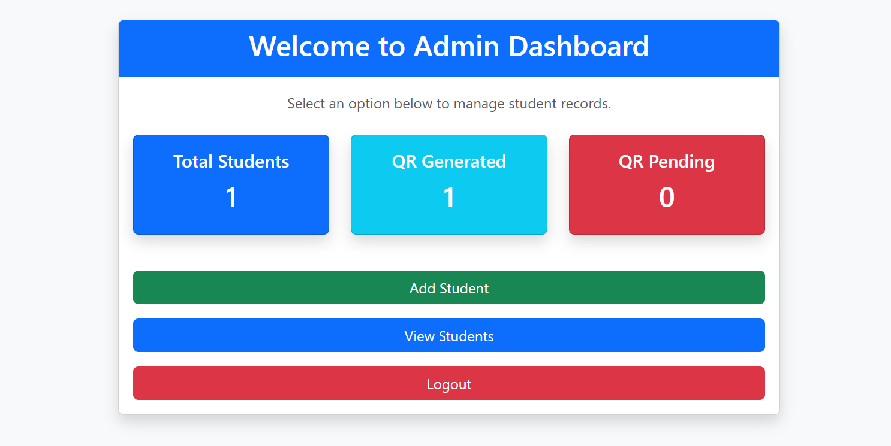
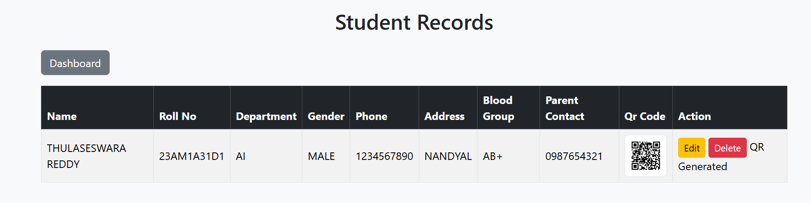
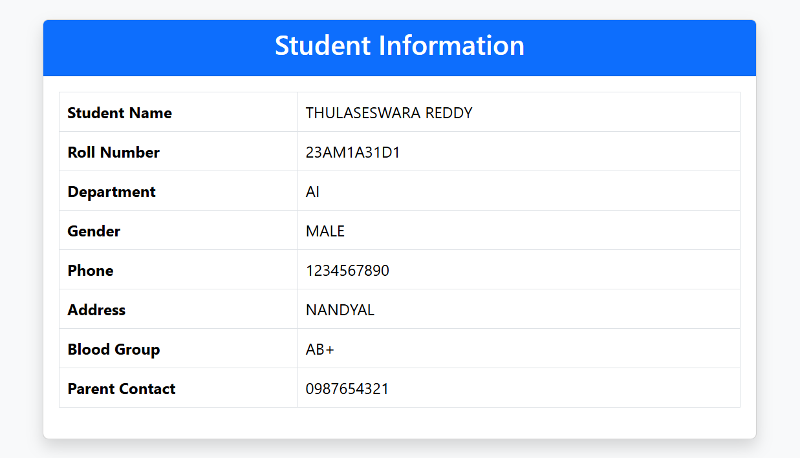

# 🎓 Smart ID Card Management System
A Flask-based Smart ID Card Management System developed using Python, Flask, MySQL, Bootstrap, and QR Code technology. This application allows an administrator to manage student records and generate QR codes that display student information when scanned.

## 🚀 Features
- Admin Login (Password Hashing)
- Secure Session Management
- Add Student
- Edit Student
- Delete Student
- View Student Details
- QR Code Generation
- QR Code Display
- Dashboard Statistics
  - Total Students
  - QR Generated
  - QR Pending
- Phone Number Validation
- Parent Number Validation
- Blood Group Validation
- Flash Success/Error Messages
- Responsive Bootstrap UI
- Exception Handling using try-except
---

## 🛠 Technologies Used

- Python
- Flask
- MySQL
- Bootstrap 5
- HTML
- CSS
- QRCode
- Pillow
- Werkzeug

---
## 📂 Project Structure

```
Smart-ID-Card-System/
│
├── app.py
├── db.py
├── requirements.txt
├── .gitignore
│
├── static/
│   └── qrcodes/
│
└── templates/
    ├── login.html
    ├── dashboard.html
    ├── add_student.html
    ├── edit_student.html
    ├── students.html
    └── student_details.html
```
---
## 📸Screenshots
```
### Login Page


### Dashboard


### Register Student


### Student Records


### Student Details

```

## ⚙️ Installation
1. Clone the repository
```bash
git clone https://github.com/ThulaseswaraReddy/Smart-IDCard.git
```
2. Open the project

```bash
cd Smart-IDCard
```


4. Create a MySQL database

```
SmartIdCard
```

5. Import the SQL database.

6. Update `db.py` with your MySQL password.

7. Run the project

```bash
python app.py
```
---

## 📱 QR Code
After generating a QR code, scanning it opens the student's information page.
---

## 📊 Dashboard

The dashboard displays:

- Total Students
- QR Generated
- QR Pending

---

## 🔒 Security

- Password hashing using Werkzeug
- Session-based authentication
- Input validation
- Exception handling

---

## 📷 Screenshots

Add screenshots here:

- Login Page
- Dashboard
- Add Student
- View Students
- QR Code
- Student Details

---

## 👨‍💻 Author

**Bannuru Thulaseswara Reddy**
GitHub: https://github.com/ThulaseswaraReddy
---
